```mermaid
graph TB
    subgraph "Client Layer"
        ReactApp[React Frontend]
        WebSocket[WebSocket Client]
    end
    
    subgraph "API Layer"
        Django[Django REST API]
        Daphne[Daphne ASGI Server]
        ChatConsumer[Chat WebSocket Consumer]
    end
    
    subgraph "Agent Layer"
        Router[Query Router]
        Pipeline[RAG Pipeline]
        ToolRegistry[Tool Registry]
    end
    
    subgraph "Tools & Services"
        LocalSearch[Local Search Tool]
        WebSearch[Web Search Tool]
        KeywordSearch[Keyword Search]
        VectorSearch[Vector Search]
        MemoryService[Memory Service]
        EmbeddingService[Embedding Service]
    end
    
    subgraph "Data Layer"
        PostgreSQL[(PostgreSQL)]
        Qdrant[(Qdrant Vector DB)]
        Redis[(Redis Cache)]
    end
    
    ReactApp --> Django
    WebSocket --> Daphne
    Daphne --> ChatConsumer
    ChatConsumer --> Pipeline
    Pipeline --> Router
    Router --> ToolRegistry
    ToolRegistry --> LocalSearch
    ToolRegistry --> WebSearch
    LocalSearch --> VectorSearch
    LocalSearch --> KeywordSearch
    VectorSearch --> Qdrant
    KeywordSearch --> PostgreSQL
    ChatConsumer --> MemoryService
    MemoryService --> PostgreSQL
    MemoryService --> Redis
    VectorSearch --> EmbeddingService
    WebSearch -.-> Internet[Internet APIs]
    
    style ReactApp fill:#61dafb
    style Django fill:#092e20
    style Qdrant fill:#dc244c
    style PostgreSQL fill:#336791
    style Redis fill:#dc382d
```

# Agentic RAG System

> **Intelligent Retrieval-Augmented Generation with Multi-Source Knowledge Integration**

An advanced RAG (Retrieval-Augmented Generation) system that combines local knowledge bases with internet search capabilities, powered by LLMs and vector embeddings. Features intelligent routing, three-tier memory architecture, and real-time chat via WebSockets.

---

## 🌟 Key Features

### Core Capabilities
- **🧠 Agentic Routing**: Automatically routes queries to local knowledge base, web search, or both
- **📚 Knowledge Base Management**: Upload and manage PDF documents with vector embeddings
- **🔍 Hybrid Search**: Combines vector search (Qdrant) with PostgreSQL keyword search
- **🌐 Internet Search Integration**: Web search capabilities for up-to-date information
- **💬 Real-time Chat**: WebSocket-based chat interface with streaming responses
- **🧩 Three-Tier Memory System**:
  - **Short-term**: Single chat session context (Redis)
  - **Medium-term**: Multi-chat session context
  - **Long-term**: Persistent user facts and preferences

### Technical Features
- **Multi-LLM Support**: OpenAI and Groq integration
- **Vector Store**: Qdrant for efficient similarity search
- **Document Processing**: PDF ingestion with chunking and embedding
- **Tool System**: Extensible tool registry for agent capabilities
- **Health Monitoring**: Built-in health checks for all services
- **CI/CD Pipeline**: Automated testing, linting, security scanning

---

## 🏗️ System Architecture



## 📁 Project Structure

```
agentic_rag/
├── apps/
│   ├── chat/              # WebSocket chat functionality
│   │   ├── consumers.py   # Chat WebSocket consumer
│   │   ├── models.py      # Chat-related models
│   │   └── routing.py     # WebSocket routing
│   │
│   ├── core/              # Core agent and utilities
│   │   ├── agent/         # RAG pipeline & routing
│   │   │   ├── pipeline.py    # Main RAG orchestration
│   │   │   ├── router.py      # Query routing logic
│   │   │   └── llm_client.py  # LLM API client
│   │   ├── services/      # Core services (embedding, memory)
│   │   └── tools/         # External tool integrations
│   │
│   ├── knowledgebase/     # Document management
│   │   ├── models.py      # Document model
│   │   ├── services.py    # PDF processing, CRUD
│   │   ├── views.py       # Document API endpoints
│   │   └── urls.py        # API routes
│   │
│   ├── rag/               # RAG-specific features
│   │   ├── models.py      # Chat history, tool logs
│   │   ├── services/      # RAG service implementation
│   │   ├── tools/         # RAG tools (search, query)
│   │   │   ├── vector_search_tool.py
│   │   │   ├── keyword_search_tool.py
│   │   │   ├── web_search_tool.py
│   │   │   └── registry.py
│   │   └── views.py       # RAG API endpoints
│   │
│   └── vectorstore/       # Qdrant integration
│       └── services.py    # Vector DB operations
│
├── config/                # Django settings
│   ├── settings.py
│   ├── urls.py
│   └── asgi.py
│
├── docs/                  # Documentation
├── tests/                 # Test suite
├── scripts/               # Utility scripts
├── docker-compose.yml     # Docker orchestration
├── Dockerfile             # Application container
├── requirements.txt       # Python dependencies
└── manage.py             # Django management
```

---

## 🎯 How It Works

### 1. **Query Routing** (Intelligent Decision Making)

When a user submits a query, the Router analyzes it and decides:
- **Local**: Query relates to uploaded documents
- **Web**: Requires up-to-date/external information
- **Both**: Needs combination of local and web sources

### 2. **Retrieval Process**

**Local Search:**
- Vector similarity search using Qdrant embeddings
- PostgreSQL keyword/trigram search for exact matches
- Combines results for comprehensive coverage

**Web Search:**
- Internet search APIs (Serper, DuckDuckGo, etc.)
- Real-time information retrieval
- News, facts, and general knowledge

### 3. **Context Building**

- Aggregates content from all sources
- Structures context with source attribution
- Optimizes for token limits

### 4. **Response Generation**

- LLM generates answer using retrieved context
- Cites sources appropriately
- Maintains conversation history in memory tiers

---

## 🚀 Quick Start

### Prerequisites
- Docker & Docker Compose
- Python 3.11+
- API Keys: OpenAI or Groq

### Installation

1. **Clone the repository**
```bash
git clone <repository-url>
cd agentic_rag
```

2. **Set up environment variables**
```bash
cp .env.example .env
# Edit .env and add your API keys:
# OPENAI_API_KEY=your_key_here
# GROQ_API_KEY=your_key_here
```

3. **Start with Docker Compose**
```bash
docker-compose up --build
```

4. **Access the application**
- API: http://localhost:8000
- API Documentation: http://localhost:8000/api/schema/swagger-ui/
- Health Check: http://localhost:8000/health/

---

## 📡 API Endpoints

### Knowledge Base Management

| Method | Endpoint | Description |
|--------|----------|-------------|
| `POST` | `/api/knowledgebase/documents/upload/` | Upload PDF document |
| `GET` | `/api/knowledgebase/documents/` | List all documents |
| `GET` | `/api/knowledgebase/documents/{id}/` | Get document details |
| `PUT` | `/api/knowledgebase/documents/{id}/` | Update document |
| `DELETE` | `/api/knowledgebase/documents/{id}/` | Delete document |

### RAG Operations

| Method | Endpoint | Description |
|--------|----------|-------------|
| `POST` | `/api/rag/query/` | Execute RAG query |
| `POST` | `/api/rag/search/` | Vector search |
| `GET` | `/api/rag/history/` | Get chat history |

### Memory System

| Method | Endpoint | Description |
|--------|----------|-------------|
| `GET` | `/api/memory/config/` | Get memory configuration |
| `POST` | `/api/memory/config/` | Update memory settings |
| `GET` | `/api/memory/stats/` | Memory statistics |

### WebSocket

| Endpoint | Description |
|----------|-------------|
| `ws://localhost:8000/ws/chat/` | Real-time chat WebSocket |

---

## 💾 Database Models

### Document (Knowledge Base)
```python
{
    "id": "uuid",
    "title": "string",
    "content": "text",
    "metadata": "json",
    "created_at": "datetime",
    "updated_at": "datetime"
}
```

### Chat History
```python
{
    "id": "int",
    "user": "string",
    "messages": "json_array",
    "created_at": "datetime",
    "updated_at": "datetime"
}
```

### Memory Types
- **ShortTermMemory**: Conversation context (Redis)
- **MediumTermMemory**: Session summaries with TTL
- **LongTermMemory**: User entities, facts, preferences

---

## 🔧 Configuration

### Environment Variables

```bash
# Database
DB_NAME=agentic_rag
DB_USER=postgres
DB_PASSWORD=postgres
DB_HOST=db
DB_PORT=5432

# Qdrant Vector Store
QDRANT_HOST=qdrant
QDRANT_PORT=6333

# Redis
REDIS_HOST=redis
REDIS_PORT=6379

# LLM Providers
OPENAI_API_KEY=your_openai_key
GROQ_API_KEY=your_groq_key
DEFAULT_LLM_PROVIDER=openai
DEFAULT_EMBEDDING_PROVIDER=openai

# Web Search (optional)
SERPER_API_KEY=your_serper_key
```

---

## 🧪 Testing

```bash
# Run all tests
pytest

# Run with coverage
pytest --cov=apps --cov-report=html

# Run specific tests
pytest tests/test_rag/

# Linting
ruff check .
```

---

## 🛠️ Technology Stack

| Component | Technology |
|-----------|-----------|
| **Backend Framework** | Django 4.2+ with Django REST Framework |
| **Async Server** | Daphne (ASGI) |
| **WebSockets** | Django Channels |
| **Database** | PostgreSQL 15 |
| **Vector Database** | Qdrant |
| **Cache/Message Broker** | Redis 7 |
| **LLM Providers** | OpenAI, Groq |
| **Embeddings** | OpenAI text-embedding-ada-002 |
| **Document Processing** | PyPDF |
| **Testing** | pytest, pytest-django, pytest-asyncio |
| **Containerization** | Docker, Docker Compose |
| **CI/CD** | GitHub Actions |

---

## 📊 Current Status & Roadmap

### ✅ Completed Features
- [x] Basic RAG pipeline with routing
- [x] PDF document ingestion
- [x] Vector search (Qdrant)
- [x] Keyword search (PostgreSQL)
- [x] Three-tier memory system
- [x] WebSocket chat interface
- [x] Multi-LLM support (OpenAI, Groq)
- [x] Docker containerization
- [x] Health checks
- [x] CI/CD pipeline

### 🚧 In Progress
- [ ] **Advanced Web Search Integration**
  - Implement Serper API integration
  - Add DuckDuckGo search fallback
  - Content extraction from URLs
  - Search result caching

- [ ] **Enhanced Knowledge Base**
  - Support for multiple file formats (DOCX, TXT, Markdown)
  - Manual knowledge base creation UI
  - Document versioning
  - Bulk upload support

- [ ] **React Frontend** (See FRONTEND_ARCHITECTURE.md for details)

### 🎯 Future Enhancements
- [ ] Multi-user authentication & authorization
- [ ] Document collections/namespaces
- [ ] Advanced chunking strategies
- [ ] Re-ranking algorithms
- [ ] Conversation branching
- [ ] Export/import knowledge bases
- [ ] Analytics dashboard
- [ ] Rate limiting & quotas
- [ ] Streaming LLM responses
- [ ] Custom tool creation interface

---

## 🤝 Contributing

1. Fork the repository
2. Create a feature branch (`git checkout -b feature/amazing-feature`)
3. Commit your changes (`git commit -m 'Add amazing feature'`)
4. Push to the branch (`git push origin feature/amazing-feature`)
5. Open a Pull Request

### Development Workflow
1. Ensure all tests pass: `pytest`
2. Code formatting: `ruff check --fix .`
3. Update documentation as needed
4. Add tests for new features

---

## 📄 License

This project is licensed under the MIT License - see the LICENSE file for details.

---

## 🙏 Acknowledgments

- OpenAI for GPT models and embeddings
- Groq for lightning-fast LLM inference
- Qdrant for vector database
- Django community for excellent framework

---

## 📞 Support

For questions, issues, or feature requests:
- Open an issue on GitHub
- Check documentation in `/docs`
- Review API schema at `/api/schema/swagger-ui/`

---

**Built with ❤️ using Django, Qdrant, and LLMs**