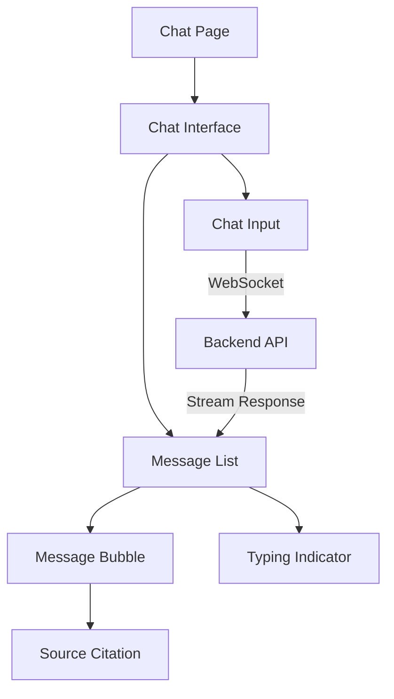
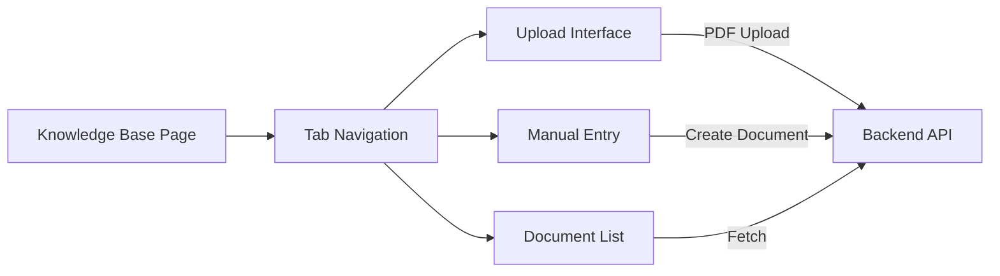

# Frontend Architecture - React Application

> **Complete Frontend Architecture for Agentic RAG System**

## 📋 Table of Contents
- [Overview](#overview)
- [Technology Stack](#technology-stack)
- [Project Structure](#project-structure)
- [Component Architecture](#component-architecture)
- [State Management](#state-management)
- [API Integration](#api-integration)
- [Features Implementation](#features-implementation)
- [Deployment Strategy](#deployment-strategy)

---

## 🎯 Overview

The React frontend provides a modern, intuitive interface for interacting with the Agentic RAG system. It features real-time chat, knowledge base management, and comprehensive analytics.

### Key Objectives
- **User-Friendly**: Intuitive UI for both technical and non-technical users
- **Real-Time**: WebSocket-powered instant responses
- **Responsive**: Mobile-first design approach
- **Accessible**: WCAG 2.1 AA compliance
- **Performant**: Optimized for speed and efficiency

---

## 🛠️ Technology Stack

### Core Technologies
```json
{
  "framework": "React 18+",
  "language": "TypeScript",
  "build_tool": "Vite",
  "routing": "React Router v6",
  "state_management": "Zustand + React Query",
  "styling": "Tailwind CSS + shadcn/ui",
  "websockets": "Socket.IO Client",
  "http_client": "Axios",
  "forms": "React Hook Form + Zod",
  "charts": "Recharts",
  "markdown": "react-markdown",
  "icons": "Lucide React"
}
```

### Development Tools
- **Package Manager**: pnpm (recommended) or npm
- **Code Quality**: ESLint, Prettier
- **Testing**: Vitest, React Testing Library, Playwright
- **Type Checking**: TypeScript strict mode

---

## 📁 Project Structure

```
frontend/
├── public/
│   ├── favicon.ico
│   └── assets/
├── src/
│   ├── components/
│   │   ├── ui/                    # Reusable UI components (shadcn/ui)
│   │   │   ├── button.tsx
│   │   │   ├── input.tsx
│   │   │   ├── dialog.tsx
│   │   │   ├── card.tsx
│   │   │   └── ...
│   │   ├── chat/                  # Chat-related components
│   │   │   ├── ChatInterface.tsx
│   │   │   ├── MessageList.tsx
│   │   │   ├── MessageBubble.tsx
│   │   │   ├── ChatInput.tsx
│   │   │   ├── TypingIndicator.tsx
│   │   │   └── SourceCitation.tsx
│   │   ├── knowledge-base/        # Knowledge base components
│   │   │   ├── DocumentList.tsx
│   │   │   ├── DocumentCard.tsx
│   │   │   ├── DocumentUpload.tsx
│   │   │   ├── DocumentViewer.tsx
│   │   │   ├── ManualDocumentForm.tsx
│   │   │   └── BulkUpload.tsx
│   │   ├── memory/                # Memory management
│   │   │   ├── MemoryConfig.tsx
│   │   │   ├── MemoryStats.tsx
│   │   │   └── MemoryViewer.tsx
│   │   ├── analytics/             # Analytics dashboard
│   │   │   ├── Dashboard.tsx
│   │   │   ├── UsageChart.tsx
│   │   │   ├── QueryAnalytics.tsx
│   │   │   └── SourceBreakdown.tsx
│   │   └── layout/                # Layout components
│   │       ├── AppLayout.tsx
│   │       ├── Sidebar.tsx
│   │       ├── Header.tsx
│   │       └── Footer.tsx
│   │
│   ├── pages/                     # Page components
│   │   ├── HomePage.tsx
│   │   ├── ChatPage.tsx
│   │   ├── KnowledgeBasePage.tsx
│   │   ├── SettingsPage.tsx
│   │   └── NotFoundPage.tsx
│   │
│   ├── hooks/                     # Custom React hooks
│   │   ├── useChat.ts
│   │   ├── useWebSocket.ts
│   │   ├── useDocuments.ts
│   │   ├── useMemory.ts
│   │   └── useQueryAnalytics.ts
│   │
│   ├── stores/                    # Zustand stores
│   │   ├── chatStore.ts
│   │   ├── documentStore.ts
│   │   ├── settingsStore.ts
│   │   └── uiStore.ts
│   │
│   ├── services/                  # API services
│   │   ├── api.ts                 # Base API configuration
│   │   ├── chatService.ts
│   │   ├── documentService.ts
│   │   ├── memoryService.ts
│   │   └── analyticsService.ts
│   │
│   ├── types/                     # TypeScript types
│   │   ├── chat.ts
│   │   ├── document.ts
│   │   ├── memory.ts
│   │   └── api.ts
│   │
│   ├── utils/                     # Utility functions
│   │   ├── formatters.ts
│   │   ├── validators.ts
│   │   ├── constants.ts
│   │   └── helpers.ts
│   │
│   ├── App.tsx                    # Main app component
│   ├── main.tsx                   # Entry point
│   ├── router.tsx                 # Route configuration
│   └── index.css                  # Global styles
│
├── package.json
├── tsconfig.json
├── vite.config.ts
├── tailwind.config.js
└── .env.example
```

---

## 🏗️ Component Architecture

### 1. Chat Interface



**Key Components:**

#### `ChatInterface.tsx`
```tsx
interface ChatInterfaceProps {
  conversationId?: string;
  initialMessages?: Message[];
}

const ChatInterface: React.FC<ChatInterfaceProps> = ({
  conversationId,
  initialMessages
}) => {
  const { messages, sendMessage, isConnected } = useChat(conversationId);
  const { isTyping } = useWebSocket();

  return (
    <div className="flex flex-col h-full">
      <MessageList messages={messages} />
      {isTyping && <TypingIndicator />}
      <ChatInput onSend={sendMessage} disabled={!isConnected} />
    </div>
  );
};
```

#### `MessageBubble.tsx`
```tsx
interface MessageBubbleProps {
  message: Message;
  showSources?: boolean;
}

const MessageBubble: React.FC<MessageBubbleProps> = ({ 
  message, 
  showSources = true 
}) => {
  return (
    <div className={cn("message-bubble", message.role)}>
      <ReactMarkdown>{message.content}</ReactMarkdown>
      {showSources && message.sources && (
        <SourceCitation sources={message.sources} />
      )}
    </div>
  );
};
```

### 2. Knowledge Base Management



**Key Components:**

#### `DocumentUpload.tsx`
```tsx
const DocumentUpload: React.FC = () => {
  const { uploadDocument, isUploading } = useDocuments();
  const [dragActive, setDragActive] = useState(false);

  const handleDrop = async (files: FileList) => {
    for (const file of Array.from(files)) {
      if (file.type === 'application/pdf') {
        await uploadDocument(file);
      }
    }
  };

  return (
    <div 
      className={cn("upload-zone", dragActive && "active")}
      onDragOver={(e) => { e.preventDefault(); setDragActive(true); }}
      onDragLeave={() => setDragActive(false)}
      onDrop={(e) => { e.preventDefault(); handleDrop(e.dataTransfer.files); }}
    >
      {/* Upload UI */}
    </div>
  );
};
```

#### `ManualDocumentForm.tsx`
```tsx
const ManualDocumentForm: React.FC = () => {
  const form = useForm<DocumentInput>({
    resolver: zodResolver(documentSchema)
  });
  const { createDocument } = useDocuments();

  const onSubmit = async (data: DocumentInput) => {
    await createDocument(data);
    form.reset();
  };

  return (
    <form onSubmit={form.handleSubmit(onSubmit)}>
      <Input {...form.register("title")} placeholder="Title" />
      <Textarea {...form.register("content")} placeholder="Content" />
      <Input {...form.register("metadata.category")} placeholder="Category" />
      <Button type="submit">Create Document</Button>
    </form>
  );
};
```

### 3. Memory Configuration

#### `MemoryConfig.tsx`
```tsx
const MemoryConfig: React.FC = () => {
  const { config, updateConfig } = useMemory();
  const form = useForm<MemoryConfigInput>({
    defaultValues: config
  });

  return (
    <Card>
      <CardHeader>
        <CardTitle>Memory Configuration</CardTitle>
      </CardHeader>
      <CardContent>
        <form onSubmit={form.handleSubmit(updateConfig)}>
          <Label>Short-Term Memory TTL (seconds)</Label>
          <Input type="number" {...form.register("short_term_ttl")} />
          
          <Label>Medium-Term Memory TTL (hours)</Label>
          <Input type="number" {...form.register("medium_term_ttl")} />
          
          <Button type="submit">Save Configuration</Button>
        </form>
      </CardContent>
    </Card>
  );
};
```

---

## 🔄 State Management

### Zustand Stores

#### `chatStore.ts`
```typescript
import { create } from 'zustand';
import { persist } from 'zustand/middleware';

interface ChatState {
  conversations: Conversation[];
  activeConversationId: string | null;
  messages: Record<string, Message[]>;
  
  setActiveConversation: (id: string) => void;
  addMessage: (conversationId: string, message: Message) => void;
  createConversation: () => string;
  clearConversation: (id: string) => void;
}

export const useChatStore = create<ChatState>()(
  persist(
    (set, get) => ({
      conversations: [],
      activeConversationId: null,
      messages: {},
      
      setActiveConversation: (id) => set({ activeConversationId: id }),
      
      addMessage: (conversationId, message) => set((state) => ({
        messages: {
          ...state.messages,
          [conversationId]: [
            ...(state.messages[conversationId] || []),
            message
          ]
        }
      })),
      
      createConversation: () => {
        const id = crypto.randomUUID();
        set((state) => ({
          conversations: [...state.conversations, { id, title: 'New Chat', createdAt: new Date() }],
          activeConversationId: id,
          messages: { ...state.messages, [id]: [] }
        }));
        return id;
      },
      
      clearConversation: (id) => set((state) => ({
        messages: { ...state.messages, [id]: [] }
      }))
    }),
    { name: 'chat-storage' }
  )
);
```

#### `documentStore.ts`
```typescript
interface DocumentState {
  documents: Document[];
  selectedDocument: Document | null;
  filters: DocumentFilters;
  
  setDocuments: (docs: Document[]) => void;
  selectDocument: (doc: Document) => void;
  updateFilters: (filters: Partial<DocumentFilters>) => void;
}

export const useDocumentStore = create<DocumentState>((set) => ({
  documents: [],
  selectedDocument: null,
  filters: { category: null, dateRange: null },
  
  setDocuments: (docs) => set({ documents: docs }),
  selectDocument: (doc) => set({ selectedDocument: doc }),
  updateFilters: (filters) => set((state) => ({
    filters: { ...state.filters, ...filters }
  }))
}));
```

### React Query for Server State

```typescript
// hooks/useDocuments.ts
import { useQuery, useMutation, useQueryClient } from '@tanstack/react-query';
import { documentService } from '@/services/documentService';

export const useDocuments = () => {
  const queryClient = useQueryClient();
  
  const { data: documents, isLoading } = useQuery({
    queryKey: ['documents'],
    queryFn: documentService.getAll
  });
  
  const uploadMutation = useMutation({
    mutationFn: documentService.upload,
    onSuccess: () => {
      queryClient.invalidateQueries({ queryKey: ['documents'] });
    }
  });
  
  const deleteMutation = useMutation({
    mutationFn: documentService.delete,
    onSuccess: () => {
      queryClient.invalidateQueries({ queryKey: ['documents'] });
    }
  });
  
  return {
    documents,
    isLoading,
    uploadDocument: uploadMutation.mutate,
    deleteDocument: deleteMutation.mutate,
    isUploading: uploadMutation.isPending
  };
};
```

---

## 🌐 API Integration

### Base API Configuration

```typescript
// services/api.ts
import axios from 'axios';

const API_BASE_URL = import.meta.env.VITE_API_URL || 'http://localhost:8000';

export const apiClient = axios.create({
  baseURL: API_BASE_URL,
  headers: {
    'Content-Type': 'application/json'
  }
});

// Request interceptor for auth tokens
apiClient.interceptors.request.use((config) => {
  const token = localStorage.getItem('auth_token');
  if (token) {
    config.headers.Authorization = `Bearer ${token}`;
  }
  return config;
});

// Response interceptor for error handling
apiClient.interceptors.response.use(
  (response) => response,
  (error) => {
    if (error.response?.status === 401) {
      // Handle unauthorized
      window.location.href = '/login';
    }
    return Promise.reject(error);
  }
);
```

### WebSocket Service

```typescript
// services/chatService.ts
import { io, Socket } from 'socket.io-client';

class ChatWebSocketService {
  private socket: Socket | null = null;
  private listeners: Map<string, Function[]> = new Map();

  connect(conversationId?: string) {
    const WS_URL = import.meta.env.VITE_WS_URL || 'ws://localhost:8000';
    
    this.socket = io(WS_URL, {
      path: '/ws/chat/',
      query: { conversation_id: conversationId }
    });

    this.socket.on('connect', () => {
      console.log('WebSocket connected');
    });

    this.socket.on('message', (data) => {
      this.emit('message', data);
    });

    this.socket.on('typing', (data) => {
      this.emit('typing', data);
    });

    this.socket.on('error', (error) => {
      console.error('WebSocket error:', error);
    });
  }

  sendMessage(message: string) {
    if (this.socket) {
      this.socket.emit('message', { content: message });
    }
  }

  on(event: string, callback: Function) {
    if (!this.listeners.has(event)) {
      this.listeners.set(event, []);
    }
    this.listeners.get(event)!.push(callback);
  }

  private emit(event: string, data: any) {
    const callbacks = this.listeners.get(event) || [];
    callbacks.forEach(cb => cb(data));
  }

  disconnect() {
    if (this.socket) {
      this.socket.disconnect();
      this.socket = null;
    }
    this.listeners.clear();
  }
}

export const chatWebSocket = new ChatWebSocketService();
```

### Document Service

```typescript
// services/documentService.ts
import { apiClient } from './api';

export const documentService = {
  async getAll() {
    const response = await apiClient.get('/api/knowledgebase/documents/');
    return response.data;
  },

  async getById(id: string) {
    const response = await apiClient.get(`/api/knowledgebase/documents/${id}/`);
    return response.data;
  },

  async upload(file: File, metadata?: Record<string, any>) {
    const formData = new FormData();
    formData.append('file', file);
    formData.append('title', file.name);
    if (metadata) {
      formData.append('metadata', JSON.stringify(metadata));
    }

    const response = await apiClient.post(
      '/api/knowledgebase/documents/upload/',
      formData,
      {
        headers: { 'Content-Type': 'multipart/form-data' }
      }
    );
    return response.data;
  },

  async create(data: { title: string; content: string; metadata?: Record<string, any> }) {
    const response = await apiClient.post('/api/knowledgebase/documents/', data);
    return response.data;
  },

  async update(id: string, data: Partial<Document>) {
    const response = await apiClient.put(`/api/knowledgebase/documents/${id}/`, data);
    return response.data;
  },

  async delete(id: string) {
    await apiClient.delete(`/api/knowledgebase/documents/${id}/`);
  }
};
```

---

## ✨ Features Implementation

### 1. Real-Time Chat with Streaming

```typescript
// hooks/useChat.ts
import { useState, useEffect, useCallback } from 'use';
import { chatWebSocket } from '@/services/chatService';
import { useChatStore } from '@/stores/chatStore';

export const useChat = (conversationId?: string) => {
  const [isConnected, setIsConnected] = useState(false);
  const [isTyping, setIsTyping] = useState(false);
  const { messages, addMessage } = useChatStore();

  useEffect(() => {
    chatWebSocket.connect(conversationId);
    
    chatWebSocket.on('connect', () => setIsConnected(true));
    chatWebSocket.on('disconnect', () => setIsConnected(false));
    
    chatWebSocket.on('message', (data: any) => {
      addMessage(conversationId || 'default', {
        id: crypto.randomUUID(),
        role: 'assistant',
        content: data.content,
        sources: data.sources,
        timestamp: new Date()
      });
      setIsTyping(false);
    });

    chatWebSocket.on('typing', () => setIsTyping(true));

    return () => {
      chatWebSocket.disconnect();
    };
  }, [conversationId]);

  const sendMessage = useCallback((content: string) => {
    const userMessage = {
      id: crypto.randomUUID(),
      role: 'user' as const,
      content,
      timestamp: new Date()
    };
    
    addMessage(conversationId || 'default', userMessage);
    chatWebSocket.sendMessage(content);
    setIsTyping(true);
  }, [conversationId]);

  return {
    messages: messages[conversationId || 'default'] || [],
    sendMessage,
    isConnected,
    isTyping
  };
};
```

### 2. Drag-and-Drop Upload

```typescript
// hooks/useFileUpload.ts
import { useState, useCallback } from 'react';
import { documentService } from '@/services/documentService';

export const useFileUpload = () => {
  const [uploading, setUploading] = useState(false);
  const [progress, setProgress] = useState(0);

  const uploadFiles = useCallback(async (files: File[]) => {
    setUploading(true);
    const results = [];

    for (let i = 0; i < files.length; i++) {
      try {
        const result = await documentService.upload(files[i]);
        results.push(result);
        setProgress(((i + 1) / files.length) * 100);
      } catch (error) {
        console.error(`Failed to upload ${files[i].name}:`, error);
      }
    }

    setUploading(false);
    setProgress(0);
    return results;
  }, []);

  return { uploadFiles, uploading, progress };
};
```

### 3. Source Citations

```typescript
// components/chat/SourceCitation.tsx
interface Source {
  type: 'local' | 'web';
  title: string;
  url?: string;
  snippet: string;
}

const SourceCitation: React.FC<{ sources: Source[] }> = ({ sources }) => {
  const [expanded, setExpanded] = useState(false);

  return (
    <div className="mt-4 border-t pt-2">
      <button 
        onClick={() => setExpanded(!expanded)}
        className="flex items-center gap-2 text-sm text-muted-foreground"
      >
        <BookOpen className="h-4 w-4" />
        {sources.length} sources
        <ChevronDown className={cn("h-4 w-4 transition", expanded && "rotate-180")} />
      </button>
      
      {expanded && (
        <div className="mt-2 space-y-2">
          {sources.map((source, idx) => (
            <Card key={idx} className="p-3">
              <div className="flex items-start gap-2">
                {source.type === 'local' ? (
                  <Database className="h-4 w-4 text-blue-500" />
                ) : (
                  <Globe className="h-4 w-4 text-green-500" />
                )}
                <div className="flex-1">
                  <div className="font-medium text-sm">{source.title}</div>
                  <p className="text-xs text-muted-foreground">{source.snippet}</p>
                  {source.url && (
                    <a href={source.url} target="_blank" rel="noopener noreferrer" 
                       className="text-xs text-blue-500 hover:underline">
                      View source →
                    </a>
                  )}
                </div>
              </div>
            </Card>
          ))}
        </div>
      )}
    </div>
  );
};
```

### 4. Analytics Dashboard

```typescript
// pages/AnalyticsPage.tsx
const AnalyticsPage: React.FC = () => {
  const { data: analytics } = useQuery({
    queryKey: ['analytics'],
    queryFn: analyticsService.getOverview
  });

  return (
    <div className="space-y-6">
      <h1 className="text-3xl font-bold">Analytics</h1>
      
      <div className="grid grid-cols-1 md:grid-cols-3 gap-4">
        <StatCard 
          title="Total Queries" 
          value={analytics?.totalQueries} 
          icon={<MessageSquare />}
        />
        <StatCard 
          title="Documents" 
          value={analytics?.totalDocuments} 
          icon={<FileText />}
        />
        <StatCard 
          title="Avg Response Time" 
          value={`${analytics?.avgResponseTime}ms`} 
          icon={<Clock />}
        />
      </div>

      <Card>
        <CardHeader>
          <CardTitle>Query Volume (Last 30 Days)</CardTitle>
        </CardHeader>
        <CardContent>
          <ResponsiveContainer width="100%" height={300}>
            <LineChart data={analytics?.queryTimeseries}>
              <CartesianGrid strokeDasharray="3 3" />
              <XAxis dataKey="date" />
              <YAxis />
              <Tooltip />
              <Line type="monotone" dataKey="count" stroke="#8884d8" />
            </LineChart>
          </ResponsiveContainer>
        </CardContent>
      </Card>

      <Card>
        <CardHeader>
          <CardTitle>Source Breakdown</CardTitle>
        </CardHeader>
        <CardContent>
          <ResponsiveContainer width="100%" height={300}>
            <PieChart>
              <Pie
                data={analytics?.sourceBreakdown}
                cx="50%"
                cy="50%"
                labelLine={false}
                label
                outerRadius={100}
                fill="#8884d8"
                dataKey="value"
              >
                {analytics?.sourceBreakdown.map((entry, index) => (
                  <Cell key={`cell-${index}`} fill={COLORS[index % COLORS.length]} />
                ))}
              </Pie>
              <Tooltip />
            </PieChart>
          </ResponsiveContainer>
        </CardContent>
      </Card>
    </div>
  );
};
```

---

## 🚀 Deployment Strategy

### Development Setup

```bash
# Clone and install
git clone <repo-url>
cd frontend
pnpm install

# Environment setup
cp .env.example .env.local
# Edit .env.local with your backend URL

# Run development server
pnpm dev
```

### Production Build

```bash
# Build for production
pnpm build

# Preview production build
pnpm preview
```

### Docker Deployment

```dockerfile
# Dockerfile
FROM node:20-alpine AS builder

WORKDIR /app
COPY package*.json ./
RUN npm ci
COPY . .
RUN npm run build

FROM nginx:alpine
COPY --from=builder /app/dist /usr/share/nginx/html
COPY nginx.conf /etc/nginx/nginx.conf
EXPOSE 80
CMD ["nginx", "-g", "daemon off;"]
```

### Environment Variables

```env
# .env.example
VITE_API_URL=http://localhost:8000
VITE_WS_URL=ws://localhost:8000
VITE_APP_NAME=Agentic RAG
VITE_ENABLE_ANALYTICS=true
```

---

## 📊 Key UX Flows

### 1. First-Time User Flow
1. Welcome screen with quick tour
2. Create first knowledge base (upload sample PDF)
3. Interactive tutorial chat
4. Explore features

### 2. Document Upload Flow
1. Navigate to Knowledge Base
2. Drag-and-drop PDF or browse
3. Add metadata (optional)
4. View upload progress
5. Confirmation & auto-indexing notification

### 3. Chat Flow
1. Start new conversation
2. Type query
3. See typing indicator
4. Receive streaming response
5. View source citations
6. Continue conversation with context

---

## 🎨 Design System

### Color Palette
```css
:root {
  --primary: #3b82f6;
  --secondary: #8b5cf6;
  --success: #10b981;
  --danger: #ef4444;
  --warning: #f59e0b;
  --background: #ffffff;
  --foreground: #0f172a;
  --muted: #94a3b8;
}

.dark {
  --background: #0f172a;
  --foreground: #f1f5f9;
}
```

### Typography
- **Headings**: Inter (700)
- **Body**: Inter (400)
- **Code**: Fira Code (400)

---

## 🔐 Security Considerations

1. **Authentication**: JWT tokens in httpOnly cookies
2. **XSS Prevention**: Sanitize markdown/HTML rendering
3. **CSRF Protection**: CSRF tokens for state-changing operations
4. **Input Validation**: Zod schemas for all forms
5. **Secure WebSockets**: WSS in production with auth

---

## 📚 Next Steps

1. **Phase 1**: Core chat interface + document upload
2. **Phase 2**: Memory configuration + analytics
3. **Phase 3**: Advanced features (search, filters, export)
4. **Phase 4**: Mobile app (React Native)

---

**Ready to build an amazing frontend! 🚀**
